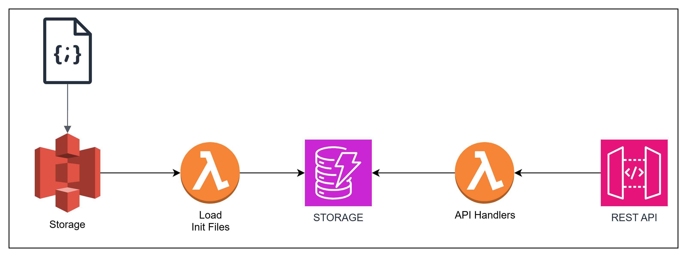

# Servicios web
Se realizaron una serie de  servicios web que permiten leer, insertar, modificar y eliminar registros de transferencias.


## Environment Variables


1.- Datos de usuario AWS para autenticar y desplegar los servicios de AWS

`AWS_ACCESS_KEY_ID`

`AWS_SECRET_ACCESS_KEY`

`AWS_DEFAULT_REGION` default: us-east-1

2.-Variable para especificar el entorno a desplegar: dev, QA, Prod, etc.

`STAGE` default; dev

3.- Esta variable de entorno es muy importante, se necesita un número ramdom para que no genere conflito al momento de nombrar el s3, pues los nombres del s3 son globales

`POSTFIX_RANDOM`


## Deployment

Se necesita tener instalado docker y la herramienta make

Para desplegar los componentes necesarios

```bash
  make deploy
```

Para eliminar los componentes generados

```bash
   make remove
```

Si requiere ejecutar el proyecto de manera local
 
```bash
  make run-local
```


Si se desea ejecutar sin docker se requiere:
NodeJs 18 y asegurase de que esten configuradas las variables de entorno.

Comandos: 

Instalar dependencias
```bash
  npm install
```

Desplegar componentes
```bash
  npx serverless deploy
```
Eliminar componentes
```bash
  npx serverless remove
```
Ejecutar de manera local
```bash
  npx serverless offline
```

## Carga Inicial

Para la carga inicial, se genero un s3,una dynamodb y una lambda.

-El nombre del s3
${env:stage}-transfers-bucket-${env:POSTFIX_RANDOM}

-Se requiere un archivo JSON y que inicie su nombre la palabra "transfer"

-Subir el archivo JSON al s3 y automaticamente se carga  la información que contiene el archivo.

## Servicios
CRUD para insertar, leer, eliminar y modificar registros de transferencias 

#### Obtener todas las transferencias

```http
  GET https://y9056g5nu3.execute-api.us-east-1.amazonaws.com/transferencias
```

#### Obtener transferencias con algunos filtros

```http
  GET https://y9056g5nu3.execute-api.us-east-1.amazonaws.com/transferencias?tipo=abono&fechaInicio=2024-06-26&fechaFin=2024-06-28&limite=10
```

#### Obtener transferencias por id
```http
  GET https://y9056g5nu3.execute-api.us-east-1.amazonaws.com/transferencias/${id}
```

| Parameter | Type     | Description                       |
| :-------- | :------- | :-------------------------------- |
| `id`      | `string` | **Required**. Id de tranferencia a buscar|

#### Insertar una tranferencia
Recibe un objeto JSON

```http
  POST https://y9056g5nu3.execute-api.us-east-1.amazonaws.com/transferencias
```

```JSON
{
  "tipo": "abono",
  "originName": "NOMBRE EMPRESA INSERT",
  "originRut": "0223335554",
  "originAccount": "00000000000087654321",
  "receiverRut": "0112223334",
  "receiverAccount": "00000012345678",
  "originBankCode": "cl_bci",
  "originBankName": "Banco BCI INSERT",
  "originAccountType": "cuenta_corriente",
  "fechaMovimiento": "PRUEBA",
  "comment": "Comentarios",
  "validated": true,
  "inUse": false,
  "monto": "200",
  
}
```

#### Eliminar transferencias por id

```http
  DELETE https://y9056g5nu3.execute-api.us-east-1.amazonaws.com/transferencias/${id}
```

| Parameter | Type     | Description                       |
| :-------- | :------- | :-------------------------------- |
| `id`      | `string` | **Required**. Id de la transferencia a eliminar|


```http
  PUT https://y9056g5nu3.execute-api.us-east-1.amazonaws.com/transferencias/${id}
```
#### Editar tranferencia por id

```JSON
{
  "tipo": "abono",
  "originName": "NOMBRE EMPRESA INSERT",
  "originRut": "0223335554",
  "originAccount": "00000000000087654321",
  "receiverRut": "0112223334",
  "receiverAccount": "00000012345678",
  "originBankCode": "cl_bci",
  "originBankName": "Banco BCI INSERT",
  "originAccountType": "cuenta_corriente",
  "fechaMovimiento": "PRUEBA",
  "comment": "Comentarios",
  "validated": true,
  "inUse": false,
  "monto": "200",
  
}
```

| Parameter | Type     | Description                |
| :-------- | :------- | :------------------------- |
| `id`      | `string` | **Required**. Id de la transferencia para editar|


## Diagrama de Infraestuctura




